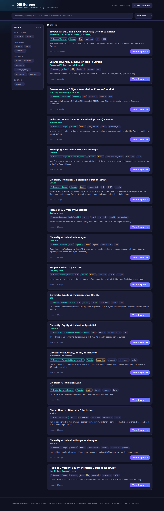
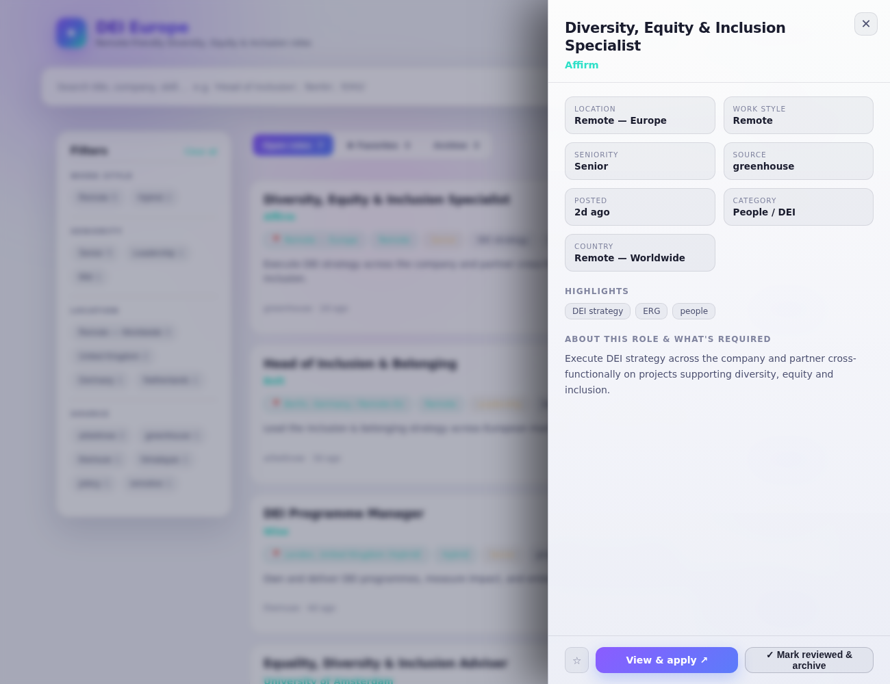
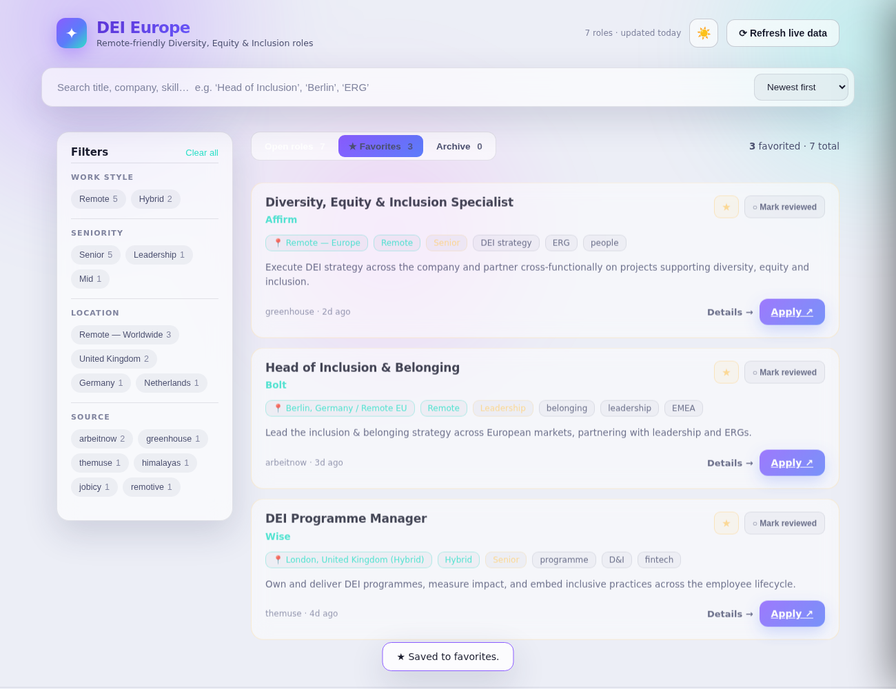
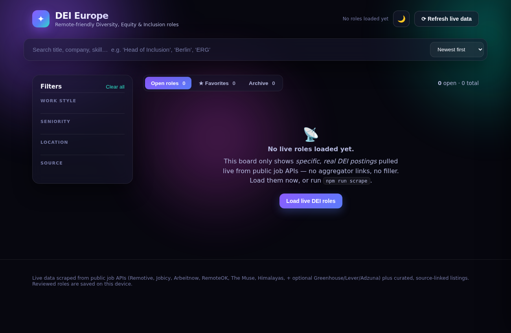

# DEI Europe — Job Board

An interactive job board focused on **remote-friendly Diversity, Equity & Inclusion (DEI) roles across Europe**.

It pulls **real, live data** from several public job APIs, keeps only **specific DEI job functions**
that are in Europe (or remote-worldwide, i.e. open to European candidates), and presents them in a
fast, filterable UI. **Every "Apply" link goes straight to the actual posting** — never to a job-board
search page or aggregator.

> Screenshots below are a UI preview populated with example DEI roles. On first run the board is
> empty until you load live data (see [Quick start](#quick-start)) — by design, so it only ever
> shows real, current postings.



Click any role to open the detail drawer; check it off to archive it, or star it to favorite it:



Light mode + the Favorites tab:



First run, before loading live data — honest and empty by design:



## Features

- 🔎 **Live scraping** of many job sources — Remotive, Jobicy, Arbeitnow (Europe-focused), RemoteOK, The Muse, and Himalayas with **no API key**, plus opt-in Greenhouse / Lever company boards and Adzuna's country-by-country European search.
- 🎯 **Strict DEI matching**: a role is kept only when its **title or tags** carry an unambiguous DEI signal (diversity, inclusion, belonging, DEI, DEIB, D&I, EDI, anti-racism…). It deliberately **ignores job descriptions**, because nearly every posting contains diversity/equity boilerplate ("equal opportunity employer", "equity compensation") — matching on that is what floods boards with non-DEI roles. Bare "equity"/"equality"/"accessibility" are *not* matched alone for the same reason. See `lib/filters.js` and the tests.
- 🔗 **Specific postings only**: each result links directly to its real job posting (the source API's canonical URL), never to a generic search/aggregator page.
- 🧭 **Interactive UI**: full-text search, plus one-click facets for work style (Remote / Hybrid), seniority, country, and source. Sort by newest / company / title.
- 🏠 **Remote & English detection**: the scraper reads each ad body (multilingual) to classify **Remote / Hybrid / On-site** even when the location is just a city, and flags whether a role **welcomes English speakers** (working language is English, ad written in English, or an English-speaking country) vs. requires a local language. Both are one-click filters.
- 🪟 **Detail drawer**: click any role to slide open a panel with the full spec grid (location, work style, language, seniority, salary, posted date…), highlights, and an "About this role & what's required" section, plus a direct apply link.
- ✅ **Reviewed → Archive workflow**: check roles off as you look at them and they move from **Open roles** into the **Archive** tab. Your progress is saved on the device (localStorage), so it survives refreshes. Restore any role back to Open in one click.
- ⭐ **Favorites tab**: star any role to save it to a dedicated **Favorites** tab (also persisted on the device). Independent of the archive, so you can shortlist and tick-off separately.
- 🌗 **Light & dark mode**: a header toggle switches themes; your choice is remembered, and it respects your system preference on first visit.
- 🎨 **Dark-glassmorphism design**: animated aurora backdrop, frosted translucent panels, and smooth micro-interactions.
- ♻️ **Refresh button** re-runs the scraper on demand from the browser (and a "Load live DEI roles" button on the first-run empty state).
- 🪶 **Tiny footprint**: one dependency (Express), plain HTML/CSS/JS frontend, no build step.

## Quick start

```bash
npm install        # installs express
npm run scrape     # pull live DEI postings into data/jobs.json
npm start          # serve the board at http://localhost:3000
```

Then open **http://localhost:3000**. (You can also skip `npm run scrape` and click **Load live
DEI roles** on the board.)

> **First run is empty on purpose.** There is no bundled/curated dataset — the board shows *only*
> live, specific DEI postings. Run `npm run scrape` (or click the load button) to populate it.
>
> **Networks.** These APIs are reachable from a normal machine or home network. Some restricted
> environments (corporate proxies, CI sandboxes, datacenter IPs) block them. The scraper is
> resilient: if a source is unreachable it logs a warning and skips it. If *all* sources are
> blocked you'll get an empty board with a clear message — run it again from your own network.

## Tests

```bash
npm test           # asserts the DEI filter keeps real DEI titles and rejects non-DEI roles
```

## How it works

```
scripts/scrape.js   →  fetches each source, normalizes to one schema,
                       filters (DEI role) AND (Europe or remote), dedupes,
                       writes data/jobs.json
lib/filters.js      →  the matching rules (strict DEI title/tag match, European
                       locations, seniority + remote classification) — testable
scripts/test-filters.js → unit tests for the DEI matcher (npm test)
server.js           →  Express: serves /public, exposes /api/jobs, /api/meta,
                       and POST /api/refresh (re-runs the scraper)
public/             →  the interactive frontend (index.html, app.js, styles.css)
data/jobs.json      →  generated output the board reads (git-ignored; created
                       by `npm run scrape`)
```

### Scraper usage

```bash
npm run scrape                      # scrape all default sources
node scripts/scrape.js --source remotive,themuse   # only specific sources
```

### Sources

| Source        | Key needed?            | Notes                                                        |
| ------------- | ---------------------- | ------------------------------------------------------------ |
| `remotive`    | no                     | Remote jobs, searched across DEI terms.                      |
| `jobicy`      | no                     | Remote jobs API.                                             |
| `arbeitnow`   | no                     | European job board (great for Germany/EU).                   |
| `remoteok`    | no                     | Remote jobs API.                                             |
| `themuse`     | no                     | Filtered to the HR & Recruiting category.                    |
| `himalayas`   | no                     | Remote-only jobs API.                                        |
| `greenhouse`  | no (opt-in env)        | Per-company boards via `GREENHOUSE_BOARDS=token1,token2`.    |
| `lever`       | no (opt-in env)        | Per-company boards via `LEVER_BOARDS=handle1,handle2`.       |
| `adzuna`      | yes (free)             | Adzuna's own API (App ID/Key) — or, as a fallback, an Apify actor (`APIFY_TOKEN`). |
| `jooble`      | yes (free, opt-in)     | Pan-European aggregator; searches each country for DEI terms. Needs `JOOBLE_KEY`. |
| `reed`        | yes (free, opt-in)     | Large UK board, strong UK DEI depth. Needs `REED_KEY`.       |

The six no-key sources run on a plain `npm run scrape`. The opt-in sources turn on
automatically when their keys are present.

#### Setting up Adzuna (recommended — best European coverage)

The `adzuna` source uses **Adzuna's own free API**, which keyword-searches whole European job
markets and is the strongest source for genuinely DEI-titled roles.

1. Register for a free API account at **https://developer.adzuna.com/** and copy your
   **App ID** and **App Key**.
2. Copy `.env.example` to `.env` and paste them in:

   ```bash
   cp .env.example .env
   ```
   ```
   ADZUNA_APP_ID=your_adzuna_app_id_here
   ADZUNA_APP_KEY=your_adzuna_app_key_here
   ```
3. Run the scraper — Adzuna now runs automatically:

   ```bash
   npm run scrape
   ```

It queries `gb, de, fr, nl, es, it, at, be, ch, pl` for DEI keywords (`what_or`), most-recent
first. Tune with `ADZUNA_QUERY` / `ADZUNA_COUNTRIES` in `.env`. The strict DEI title filter then
keeps only real DEI roles. Your `.env` is git-ignored, so your keys stay local.

**Alternative: Adzuna via Apify.** If you'd rather run an Adzuna scraper actor on
[Apify](https://apify.com/) instead, leave `ADZUNA_APP_ID/KEY` unset and provide `APIFY_TOKEN`
(plus optionally `APIFY_ADZUNA_ACTOR` and `APIFY_ADZUNA_INPUT` — the exact input JSON copied from
your chosen actor's page). Output fields are mapped defensively. Note Apify actors consume compute
units and the sync run waits up to ~5 min, so keep `APIFY_MAX_ITEMS` modest.

#### More European aggregators (optional)

Add even more coverage by dropping these free keys into `.env` (each runs automatically once its
key is present, and is filtered to specific DEI roles the same way):

- **Jooble** (pan-European) — get a key at https://jooble.org/api/about, then set `JOOBLE_KEY`.
  Tune the countries with `JOOBLE_LOCATIONS`.
- **Reed** (UK, deep DEI coverage) — get a key at https://www.reed.co.uk/developers, then set `REED_KEY`.

Both reuse `DEI_TERMS` (default `diversity,inclusion,belonging,DEI`) as the search terms.

The same `.env` enables the company-ATS sources:

```
GREENHOUSE_BOARDS=elastic,mongodb
LEVER_BOARDS=netflix,plaid
```

### API

| Endpoint            | Description                                                            |
| ------------------- | ---------------------------------------------------------------------- |
| `GET /api/jobs`     | Filtered list. Query params: `q`, `country`, `seniority`, `remote`, `source`, `sort`. |
| `GET /api/meta`     | Facet counts (countries, seniorities, work styles, sources) + last-updated time.       |
| `POST /api/refresh` | Re-runs the scraper, then the board reloads with fresh data.           |

## Adding more sources

Each source is a small adapter function in `scripts/scrape.js` that returns rows in a common
shape. To add one, write a `fromX()` adapter and register it in the `SOURCES` map as
`{ fn: fromX, default: true }` (use `default: !!process.env.MY_KEY` to make it opt-in).
Filtering, dedup, and merge happen automatically. Tune what counts as "DEI" or "Europe"
in `lib/filters.js`.

## Customising the search

The defaults target DEI + Europe + remote. To refocus (different field, different region),
edit the keyword/location lists in `lib/filters.js` — that's the single place the matching
rules live.

---

Built as a focused tool for a European DEI job search. Data belongs to the respective job boards and employers; this project just aggregates and links to it.
